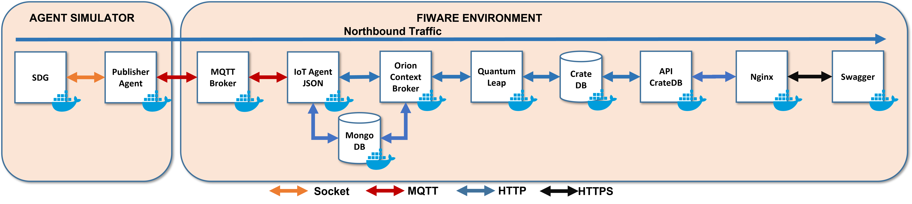

# Dev Mode: Fiware Deployment for Positioning System

This is project is an ad-hoc implementation for sending positioning data using the [SDG](https://github.com/sfl0r3nz05/CSV-Data-Sender.git) and [Publisher Agent](https://github.com/sfl0r3nz05/Publisher-Agent.git) projects. In addition constitues the *Development Mode* of the [Fiware Production for Positioning System](https://github.com/sfl0r3nz05/FiwareProdModeForPositionSystem.git) project.

## Project status

- The project is under development: 🛠 by [sfl0r3nz05](sfigueroa@ceit.es)

## Architecture

## How to use

1. [Prerequsites](./documentation/Prerequsites.md).
2. [How to deploy the architecture components](./documentation/HowToUse.md).

### Demonstration

- [Demonstration of sending data to the next information flow: SDG -> Publisher Agent MQTT -> Fiware](https://youtu.be/gJ2BJ4i7nQw)

## To Do

1. Create a full secure branch