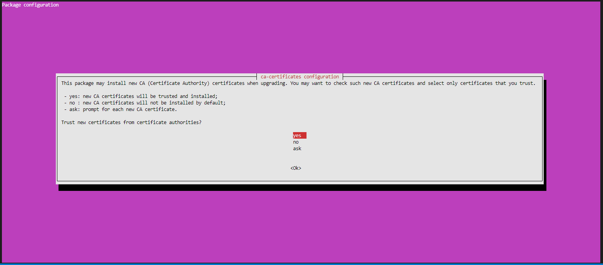
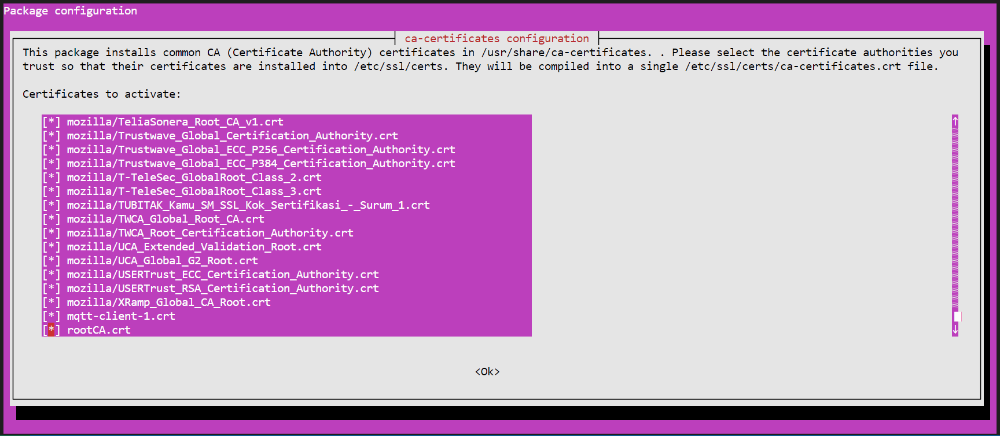
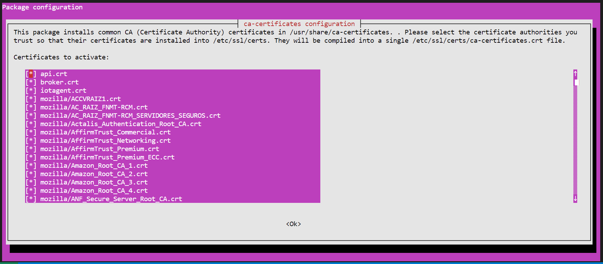

# Security Layers

- [Create a CA](#create-a-ca)
- [Add security to APIs](#add-security-to-apis)

## Create a CA

1. Modify the hostname in `/etc/hostname`

    - Expected output of `hostname` command:

    ```console
    $ hostname
    ic2m2
    ```

2. Modify the host in `/etc/hosts`. E.g.:

	  ```console
	  127.0.0.1 localhost
	  10.63.27.39 ic2m2
	  ```

3. Create a `cert` folder: `mkdir cert && cd cert`

4. Generate a key for `rootCA`:

	```console
	openssl genrsa -des3 -out rootCA.key 2048
	```

5. Generate a certificate for `rootCA`:

	```console
	openssl req -x509 -new -nodes -key rootCA.key -sha256 -days 730 -out rootCA.pem
	```

  - Expected output:

	  ```console
	  You are about to be asked to enter information that will be incorporated
    into your certificate request.
    What you are about to enter is what is called a Distinguished Name or a DN.
    There are quite a few fields but you can leave some blank
    For some fields there will be a default value,
    If you enter '.', the field will be left blank.
    -----
    Country Name (2 letter code) [AU]:ES
    State or Province Name (full name) [Some-State]:Gipuzkoa
    Locality Name (eg, city) []:SS
    Organization Name (eg, company) [Internet Widgits Pty Ltd]:CEIT
    Organizational Unit Name (eg, section) []:DAIM
    Common Name (e.g. server FQDN or YOUR name) []:ic2m2
    Email Address []:sfigueroa@ceit.es
	  ```

6. Convert certificate from pem to `crt`:

	```console
	openssl x509 -outform pem -in rootCA.pem -out rootCA.crt
	```

7. Certificate verification:

	```console
	openssl x509 -in rootCA.pem -text -noout
	```

8. Copy `rootCA.crt` certificate to the `ca-certificates` folder:

	```console
	sudo cp rootCA.crt /usr/share/ca-certificates/
	```

9. Install certificates:

	```console
	sudo dpkg-reconfigure ca-certificates
	```

  - Expected output:

    |  |  |
    |---|---|

10. Update installed certificates:

	```console
	sudo update-ca-certificates
	```

## Add security to APIs

   > **Note:** As shown in the architecture image for securing the APIs, a reverse proxy has been set up.

11. Generate the private key for a broker

    ```console
	openssl genrsa -out api.key 2048
    ```

12. Generate the `csr` file:

    ```console
	openssl req -new -key api.key -out api.csr
    ```

	- Expected output:

	  ```console
      You are about to be asked to enter information that will be incorporated
	  into your certificate request.
	  What you are about to enter is what is called a Distinguished Name or a DN.
	  There are quite a few fields but you can leave some blank
	  For some fields there will be a default value,
	  If you enter '.', the field will be left blank.
	  -----
	  Country Name (2 letter code) [AU]:ES
	  State or Province Name (full name) [Some-State]:Gipuzkoa
	  Locality Name (eg, city) []:SS
	  Organization Name (eg, company) [Internet Widgits Pty Ltd]:CEIT
	  Organizational Unit Name (eg, section) []:DAIM
	  Common Name (e.g. server FQDN or YOUR name) []:ic2m2
	  Email Address []:sfigueroa@ceit.es
  
	  Please enter the following 'extra' attributes
	  to be sent with your certificate request
	  A challenge password []:Ceit_1234
	  An optional company name []:ii40
	  ```

13. Create a config file `openssl.cnf` with a list of domain names associated with the certificate:

	  ```console
	  # Extensions to add to a certificate request
	  basicConstraints       = CA:FALSE
	  authorityKeyIdentifier = keyid:always, issuer:always
	  keyUsage               = nonRepudiation, digitalSignature, keyEncipherment, dataEncipherment
	  subjectAltName         = @alt_names
	  [ alt_names ]
	  DNS.1 = api-crate
	  DNS.2 = api-orion
	  DNS.3 = apikey-mng
	  DNS.4 = nginx
	  DNS.5 = ic2m2
	  DNS.6 = localhost
	  IP.1 = 10.63.27.39
	  IP.2 = 127.0.0.1
	  ```

14. Sign the broker certificate using the rootCA:

	```console
	openssl x509 -req \
  	 -in api.csr \
  	 -CA rootCA.pem \
     -CAkey rootCA.key \
     -CAcreateserial \
     -out api.crt \
     -days 730 \
     -sha256 \
     -extfile openssl.cnf
	```

	- Expected output:

	  ```console
	  Signature ok
	  subject=C = ES, ST = Gipuzkoa, L = SS, O = CEIT, OU = DAIM, CN = ic2m2, emailAddress = sfigueroa@ceit.es
	  Getting CA Private Key
	  Enter pass phrase for rootCA.key:
	  ```

15. Certificate verification: 

	```console
	openssl verify -CAfile rootCA.pem -verify_hostname api-orion api.crt
	```

	- Expected output:

  	  ```console
	  api.crt: OK
	  ```

	```console
	openssl verify -CAfile rootCA.pem -verify_hostname api-crate api.crt
	```

	- Expected output:

  	  ```console
	  api.crt: OK
	  ```

16. Create a `certs/` folder:

	```console
	mkdir -p ~/FiwareDockerDevMode/nginx/certs/
	```

17. Enable specific permission for `certs/` folder`:

	```console
	sudo chmod 775 -R ~/FiwareDockerDevMode/nginx/certs/
	```

18. Copy `api.crt` into `nginx` `cert` folder:

	```console
	sudo cp api.crt ~/FiwareDockerDevMode/nginx/certs/nginx-selfsigned.crt
	```

19. Copy `api.key` into `nginx` `cert` folder:

	```console
	sudo cp api.key ~/FiwareDockerDevMode/nginx/certs/nginx-selfsigned.key
	```

20. Randomly generate `dhparam.pem` file:

	```console
	cd ~/FiwareDockerDevMode/nginx/certs/
	```

	```console
	openssl dhparam -out dhparam.pem 2048
	```

	- Expected output:

		```console
		-----BEGIN DH PARAMETERS-----
		MIIBCAKCAQEA7m7a4+oHzaWEPzmMQ+4DpoprRQStXHZHlny/e8pYPa3PJTR1Iv7M
		u0k7P8ToDRKdJSQXBpSXBo+K34kePpaiLBd1e3PkCnuI+4RutZy2NXwZK2Uv6IAf
		ZzXVvjBFLtgDVEd05rvJNamTbRapMQmqmqf4gsDPeWgj9nobaE89mdlguwU78wyZ
		aB5R/8yGqWSlvogXX820kxw2oU4/qS7m37qXqV/82LmLZ0exuYtnTzvwtSaMqaVj
		3KP8Pvfk4XOsaopyEpQE3DzB/J8JglQfR/AfsgspV65BppFhcsoBSTLpHYesZQkS
		00TAJP0S0KdGcjFTnpH6BT108qgviedN2wIBAg==
		-----END DH PARAMETERS-----
		```

21. Copy `api.crt` certificate to the ca-certificates folder:

	```console
	cd ~/cert
	```

	```console
	sudo cp api.crt /usr/share/ca-certificates/
	```

	- Expected output:

    |  |  |
    |---|---|

22. Install certificates:

	```console
	sudo dpkg-reconfigure ca-certificates
	```

23. Update installed certificates:

	```console
	sudo update-ca-certificates
	```

24. Introduce the following changes in `nginx.conf`:

	```console
	cd ~/FiwareDockerDevMode/nginx/
	```

	- API-Crate

		```console
		# API-CRATE
    	server {
        	listen 8080 http2 ssl;
        	server_name ic2m2;
        	ssl_certificate /certs/nginx-selfsigned.crt;
        	ssl_certificate_key /certs/nginx-selfsigned.key;
        	ssl_dhparam /certs/dhparam.pem;
			...
			...
			...
        	location / {
           		proxy_pass http://api-crate:8080;
				...
				...
				...
			}

    	}
		```
